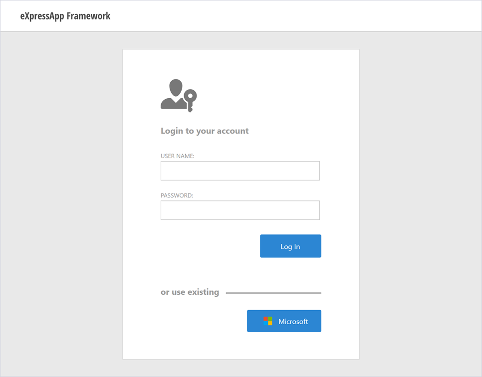

### This topic demonstrates how to extend your ASP.NET Web Forms application with OAuth authentication providers


Install these packages in Web project
- Microsoft.Owin
- Microsoft.IdentityModel.Protocols.OpenIdConnect
- Microsoft.Owin.Security.OpenIdConnect
- Microsoft.Owin.Security.Cookies
- Microsoft.AspNet.Identity.Owin
- Microsoft.Owin.Host.SystemWeb

- Create a class startup.cs in web project

```csharp
using Microsoft.IdentityModel.Protocols.OpenIdConnect;
using Microsoft.IdentityModel.Tokens;
using Microsoft.Owin;
using Microsoft.Owin.Security;
using Microsoft.Owin.Security.Cookies;
using Microsoft.Owin.Security.Notifications;
using Microsoft.Owin.Security.OpenIdConnect;
using Owin;
using System;
using System.Threading.Tasks;

[assembly: OwinStartup(typeof(AzureOauth.Web.Startup))]

namespace AzureOauth.Web
{

    public class Startup
    {
        // The Client ID is used by the application to uniquely identify itself to Microsoft identity platform.
        string clientId = System.Configuration.ConfigurationManager.AppSettings["ClientId"];

        // RedirectUri is the URL where the user will be redirected to after they sign in.
        string redirectUri = System.Configuration.ConfigurationManager.AppSettings["RedirectUri"];

        // Tenant is the tenant ID (e.g. contoso.onmicrosoft.com, or 'common' for multi-tenant)
        static string tenant = System.Configuration.ConfigurationManager.AppSettings["Tenant"];

        // Authority is the URL for authority, composed of the Microsoft identity platform and the tenant name (e.g. https://login.microsoftonline.com/contoso.onmicrosoft.com/v2.0)
        string authority = String.Format(System.Globalization.CultureInfo.InvariantCulture, System.Configuration.ConfigurationManager.AppSettings["Authority"], tenant);

        /// <summary>
        /// Configure OWIN to use OpenIdConnect
        /// </summary>
        /// <param name="app"></param>
        public void Configuration(IAppBuilder app)
        {
            app.SetDefaultSignInAsAuthenticationType(CookieAuthenticationDefaults.AuthenticationType);

            app.UseCookieAuthentication(new CookieAuthenticationOptions());
            app.UseOpenIdConnectAuthentication(
                new OpenIdConnectAuthenticationOptions
                {
                    // Sets the ClientId, authority, RedirectUri as obtained from web.config
                    ClientId = clientId,
                    Authority = authority,
                    RedirectUri = redirectUri,
                    // PostLogoutRedirectUri is the page that users will be redirected to after sign-out. In this case, it is using the home page
                    PostLogoutRedirectUri = redirectUri,
                    Scope = OpenIdConnectScope.OpenIdProfile,
                    // ResponseType is set to request the code id_token - which contains basic information about the signed-in user
                    ResponseType = OpenIdConnectResponseType.CodeIdToken,
                    // ValidateIssuer set to false to allow personal and work accounts from any organization to sign in to your application
                    // To only allow users from a single organizations, set ValidateIssuer to true and 'tenant' setting in web.config to the tenant name
                    // To allow users from only a list of specific organizations, set ValidateIssuer to true and use ValidIssuers parameter
                    TokenValidationParameters = new TokenValidationParameters()
                    {
                        ValidateIssuer = true // This is a simplification
                    },
                    // OpenIdConnectAuthenticationNotifications configures OWIN to send notification of failed authentications to OnAuthenticationFailed method
                    Notifications = new OpenIdConnectAuthenticationNotifications
                    {
                        AuthenticationFailed = OnAuthenticationFailed
                    }
                }
            );
        }

        /// <summary>
        /// Handle failed authentication requests by redirecting the user to the home page with an error in the query string
        /// </summary>
        /// <param name="context"></param>
        /// <returns></returns>
        private Task OnAuthenticationFailed(AuthenticationFailedNotification<OpenIdConnectMessage, OpenIdConnectAuthenticationOptions> context)
        {
            context.HandleResponse();
            context.Response.Redirect("/?errormessage=" + context.Exception.Message);
            return Task.FromResult(0);
        }
    }
}

```

- Set Azure Application 


- In web.config insert in appSettings:
```xml
    <add key="ClientId" value="8FFB4A0B-D094-46F7-99F9-FA7B40912223" />
    <add key="Tenant" value="ECB7DBF9-D5DB-4732-8393-FEF14F4B9C03" />
    <add key="Authority" value="https://login.microsoftonline.com/{0}/v2.0" />
    <add key="redirectUri" value="https://localhost:44368/" />
  </appSettings>
```

- In the same file, set the authentication mode to None and comment out settings related to the default XAF authentication:
```xml
<?xml version="1.0" encoding="utf-8"?>
<!-- ... -->
<configuration>
<!-- ... -->
  <system.web>
  <!-- ... -->
    <authentication mode="None">
      <!--<forms name="Login" loginUrl="Login.aspx" path="/" timeout="10" defaultUrl="/" />-->
    </authentication>
    <!--<authorization>
      <deny users="?" />
      <allow users="*" />
    </authorization>-->
    <!-- ... -->
  </system.web>
  <!-- ... -->
</configuration>
```


- Insert in application project a logon template content:


- Add a row in table of logon template content:

```xml
                     <table class="LogonContent LogonContentWidth">
                        <tr>
                            ...
                        </tr>
                        <tr>
                            <td>
                                <table id="UseExisting" class="StaticText width100" style="margin: 50px 0 20px;">
                                    <tr>
                                        <td style="min-width: 130px;">or use existing</td>
                                        <td class="width100" style="padding-top: 7px;">
                                            <hr>
                                        </td>
                                    </tr>
                                </table>
                                <xaf:XafUpdatePanel ID="XafUpdatePanelOAuth" runat="server" CssClass="UPOAuth right">
                                    <xaf:ActionContainerHolder ID="OAuthActions" CssClass="UPOAuthACH" runat="server" Orientation="Horizontal" ContainerStyle="Buttons">
                                        <Menu ID="OAuthMenu" ClientInstanceName="UPOAuthMenu" HorizontalAlign="Left" Width="100%" ItemAutoWidth="False" />
                                        <ActionContainers>
                                            <xaf:WebActionContainer ContainerId="OAuthActions" />
                                        </ActionContainers>
                                    </xaf:ActionContainerHolder>
                                </xaf:XafUpdatePanel>
                            </td>
                        </tr>
                    </table>
 
```
- In global.asax in Session_Start add:

WebApplication.Instance.Settings.LogonTemplateContentPath = "LogonTemplateContentAzure.ascx";

```csharp
protected void Session_Start(Object sender, EventArgs e) {
            Tracing.Initialize();
            WebApplication.SetInstance(Session, new AzureOauthAspNetApplication());
            SecurityStrategy security = WebApplication.Instance.GetSecurityStrategy();
            security.RegisterXPOAdapterProviders();
            DevExpress.ExpressApp.Web.Templates.DefaultVerticalTemplateContentNew.ClearSizeLimit();
            WebApplication.Instance.SwitchToNewStyle();

            WebApplication.Instance.Settings.LogonTemplateContentPath = "LogonTemplateContentAzure.ascx";
```

- In file login.aspx substitute header with:
```xml
<head id="Head1" runat="server">
    <title>Logon</title>
    <style>
        .LogonTemplate .UPOAuth .menuButtons .dxm-item {
            background-color: white !important;
            color: #2C86D3 !important;
            border: 1px solid #d3d3d3 !important;
        }

        .LogonTemplate .UPOAuth .menuButtons .dxm-item .dx-vam {
            color: #2C86D3 !important;
        }

        .LogonTemplate .UPOAuth .menuButtons .dxm-item.dxm-hovered {
            background-color: white !important;
            color: #2C86D3 !important;
            border: 1px solid #d3d3d3 !important;
        }

        .LogonTemplate .UPOAuth .menuButtons.menuButtons_XafTheme .dxm-item a.dx {
            padding: 7px 21px 7px 21px !important;
            width: 105px;
        }

        .LogonTemplate .UPOAuth .dxm-spacing {
            padding: 0 !important;
        }

        .LogonTemplate .UPOAuth .menuButtons.menuButtons_XafTheme .dxm-item a.dx .dx-vam {
            padding-left: 5px;
        }

        .LogonTemplate .UPOAuth .menuActionImageSVG .dxm-image,
        .LogonTemplate .UPOAuth .dxm-popup .menuActionImageSVG .dxm-image,
        .LogonTemplate .UPOAuth .smallImage2 .dxm-image,
        .LogonTemplate .UPOAuth .dxm-popup .smallImage2 .dxm-image {
            padding: 3px 4px 3px 4px !important;
        }

        .LogonTemplate .UPOAuth .menuButtons.menuButtons_XafTheme .dxm-item.dxm-hovered a.dx {
            color: #2C86D3 !important;
            background-color: #F0F0F0 !important;
            background-image: none;
        }

        .LogonTemplate .UPOAuth .menuButtons .dxm-item {
            padding-left: 0px !important;
            padding-right: 0px !important;
            float: left;
            margin: 8px 8px 0 0;
        }

        .LogonTemplate .UPOAuth .menuButtons .dxm-item.LoginWithMicrosoft,
        .LogonTemplate .UPOAuth .menuButtons.menuButtons_XafTheme .dxm-item.LoginWithMicrosoft.dxm-hovered a.dx,
        .LogonTemplate .UPOAuth .menuButtons .dxm-item.LoginWithMicrosoft .dx-vam {
            background-color: #2c86d3 !important;
            color: #fff !important;
            border: none !important;
        }

        .StaticText {
            color: #9a9a9a;
            font-weight: bold;
            font-size: 17px;
        }
    </style>
    <script>
        function SetVisibleUserExistingText(visible) {
            function SetVisible() {
                if (visible) {
                    document.getElementById('UseExisting').style.display = 'table';
                } else {
                    document.getElementById('UseExisting').style.display = 'none';
                }
            }
            if (document.getElementById('UseExisting')) {
                SetVisible();
            } else {
                document.addEventListener("DOMContentLoaded", function () { SetVisible(); });
            }
        }
    </script>
</head>
```

- In project Module.Web add in images the file Microsoft.svg and set its Build Action property to Embedded Resource

- Extend the default user class (applicationUser.cs) with the following properties and add the additional EmailEntity class
```csharp
    [MapInheritance(MapInheritanceType.ParentTable)]
    [DefaultProperty(nameof(UserName))]
    public class ApplicationUser : PermissionPolicyUser, IObjectSpaceLink, ISecurityUserWithLoginInfo {
        ...

        public bool EnableStandardAuthentication
        {
            get { return GetPropertyValue<bool>(nameof(EnableStandardAuthentication)); }
            set { SetPropertyValue(nameof(EnableStandardAuthentication), value); }
        }
        [Association, Aggregated]
        public XPCollection<EmailEntity> OAuthAuthenticationEmails
        {
            get { return GetCollection<EmailEntity>(nameof(OAuthAuthenticationEmails)); }
        }
    }

    public class EmailEntity : BaseObject
    {
        public EmailEntity(Session session) : base(session)
        {
        }
        [RuleUniqueValue("Unique_Email", DefaultContexts.Save, CriteriaEvaluationBehavior = CriteriaEvaluationBehavior.BeforeTransaction)]
        public string Email
        {
            get { return GetPropertyValue<string>(nameof(Email)); }
            set { SetPropertyValue(nameof(Email), value); }
        }
        [Association]
        public ApplicationUser ApplicationUser
        {
            get { return GetPropertyValue<ApplicationUser>(nameof(ApplicationUser)); }
            set { SetPropertyValue(nameof(ApplicationUser), value); }
        }
    }
```

When users logon with their Microsoft account, the Security System creates a new user object with the email address as the user name. Each user can have several associated email addresses. To add or remove an email address, use the OAuth Authorization Emails list in the users Detail View.


- Implement the custom authentication provider (security\CustomAuthenticationStandardProvider.cs) in the platform-agnostic Module project:
```csharp
public class CustomAuthenticationStandardProvider : AuthenticationStandardProvider
    {
        public CustomAuthenticationStandardProvider(Type userType) : base(userType)
        {
        }
        public override object Authenticate(IObjectSpace objectSpace)
        {
            ApplicationUser user = base.Authenticate(objectSpace) as ApplicationUser;
            if (user != null && !user.EnableStandardAuthentication)
            {
                throw new InvalidOperationException("Password authentication is not allowed for this user.");
            }
            return user;
        }
    }
```

- Create the descendant of the SecurityStrategyComplex class (security\CustomSecurityStrategyComplex.cs) in the platform-specific Module project:
```csharp
public class CustomSecurityStrategyComplex : SecurityStrategyComplex
    {
        protected override void InitializeNewUserCore(IObjectSpace objectSpace, object user)
        {
            base.InitializeNewUserCore(objectSpace, user);
        }
        public void InitializeNewUser(IObjectSpace objectSpace, object user)
        {
            InitializeNewUserCore(objectSpace, user);
        }
        public override void Logoff()
        {
            if (HttpContext.Current.Request.Cookies[".AspNet.External"] != null)
            {
                HttpContext.Current.Response.Cookies[".AspNet.External"].Expires = DateTime.Now.AddDays(-1);
            }
            base.Logoff();
        }
    }
```

- Add the additional ASP.NET Web Forms-specific authentication provider (MySolution.Web\Security\OAuthProvider.cs) in the application project (MySolution.Web):

```csharp
public class OAuthProvider : IAuthenticationProvider
    {
        private readonly Type userType;
        private readonly SecurityStrategyComplex security;
        public bool CreateUserAutomatically { get; set; }
        public OAuthProvider(Type userType, SecurityStrategyComplex security)
        {
            Guard.ArgumentNotNull(userType, "userType");
            this.userType = userType;
            this.security = security;
        }
        public object Authenticate(IObjectSpace objectSpace)
        {
            ApplicationUser user = null;
            ClaimsIdentity externalLoginInfo = Authenticate();
            if (externalLoginInfo != null)
            {
                string userEmail = externalLoginInfo?.FindFirst("preferred_username")?.Value;
                if (userEmail != null)
                {
                    user = (ApplicationUser)objectSpace.FindObject(userType, CriteriaOperator.Parse("OAuthAuthenticationEmails[Email = ?]", userEmail));
                    if (user == null && CreateUserAutomatically)
                    {
                        user = (ApplicationUser)objectSpace.CreateObject(userType);
                        user.UserName = userEmail;
                        EmailEntity email = objectSpace.CreateObject<EmailEntity>();
                        email.Email = userEmail;
                        user.OAuthAuthenticationEmails.Add(email);
                        ((CustomSecurityStrategyComplex)security).InitializeNewUser(objectSpace, user);
                        objectSpace.CommitChanges();
                    }
                }
            }
            else
            {
                WebApplication.Redirect(WebApplication.LogonPage);
            }
            if (user == null)
            {
                throw new Exception("Login failed");
            }
            return user;
        }
        private ClaimsIdentity Authenticate()
        {
            return HttpContext.Current.GetOwinContext().Authentication.User.Identity as ClaimsIdentity;
        }
        public void Setup(params object[] args)
        {
        }
    }
```

- Replace the default SecurityStrategyComplex used in your application with the custom CustomSecurityStrategyComplex. Also, use AuthenticationMixed instead of your authentication:
in MySolution.Web\WebApplication.cs.


```csharp
        public AzureOauthAspNetApplication() {
            InitializeComponent();
            ....

            AuthenticationMixed authenticationMixed = new AuthenticationMixed();
            authenticationMixed.LogonParametersType = typeof(AuthenticationStandardLogonParameters);
            authenticationMixed.AuthenticationProviders.Add(typeof(CustomAuthenticationStandardProvider).Name, new                  CustomAuthenticationStandardProvider(typeof(ApplicationUser)));
            OAuthProvider authProvider = new OAuthProvider(typeof(ApplicationUser), securityStrategyComplex1);
            // Set the property below to "false" to disable autocreation of user objects.
            authProvider.CreateUserAutomatically = false;
            authenticationMixed.AuthenticationProviders.Add(typeof(OAuthProvider).Name, authProvider);
            securityStrategyComplex1.Authentication = authenticationMixed;

        }

        private void InitializeComponent() {
            ...
            //this.securityStrategyComplex1 = new DevExpress.ExpressApp.Security.SecurityStrategyComplex();
            this.securityStrategyComplex1 = new CustomSecurityStrategyComplex();
            ...


```

When CreateUserAutomatically is set to false, the Security System allows logon if a user with the email returned by the external service exists in the application database. To grant access to a user with a specific email, use an admin account, create a user object, and set the UserName to this email.

- Create the Controller in the platform-specific Module project:
File: MySolution.Module.Web\Controllers\LogonAuthController.cs.

```csharp
public class LogonAuthController : ViewController<DetailView>
    {
        public const string OAuthParameter = "oauth";
        private SimpleAction microsoftAction;

        public LogonAuthController()
        {
            TargetObjectType = typeof(AuthenticationStandardLogonParameters);
            microsoftAction = new SimpleAction(this, "LoginWithMicrosoft", "OAuthActions");
            microsoftAction.Execute += microsoftAccountAction_Execute;
            microsoftAction.Caption = "Microsoft";
        }
        protected override void OnActivated()
        {
            base.OnActivated();
            LogonController logonController = Frame.GetController<LogonController>();
            if (logonController != null)
            {
                logonController.AcceptAction.Changed += AcceptAction_Changed;
            }
        }
        private void Challenge(string provider)
        {
            
            string redirectUrl = WebApplication.LogonPage + "?oauth=true";
            ServicePointManager.SecurityProtocol = SecurityProtocolType.Tls12;
            AuthenticationProperties properties = new AuthenticationProperties() { RedirectUri = redirectUrl};


            HttpContext.Current.GetOwinContext().Authentication.Challenge(properties,
            OpenIdConnectAuthenticationDefaults.AuthenticationType);

        }
        private void microsoftAccountAction_Execute(object sender, SimpleActionExecuteEventArgs e)
        {
            Challenge(OpenIdConnectAuthenticationDefaults.AuthenticationType); //"Microsoft"
        }
        private IList<string> GetProviderNames()
        {
            IList<AuthenticationDescription> descriptions = HttpContext.Current.GetOwinContext().Authentication.GetAuthenticationTypes((AuthenticationDescription d) => d.Properties != null) as IList<AuthenticationDescription>; //&& d.Properties.ContainsKey("Caption")
            List<string> providersNames = new List<string>();
            foreach (AuthenticationDescription description in descriptions)
            {
                providersNames.Add(description.AuthenticationType);
            }
            return providersNames;
        }
        private void CurrentRequestPage_Load(object sender, System.EventArgs e)
        {
            ((Page)sender).Load -= CurrentRequestPage_Load;
            LogonController logonController = Frame.GetController<LogonController>();
            if (logonController != null && logonController.AcceptAction.Active)
            {
                ((ISupportMixedAuthentication)Application.Security).AuthenticationMixed.SetupAuthenticationProvider("OAuthProvider");
                logonController.AcceptAction.DoExecute();
            }
        }
        private void AcceptAction_Changed(object sender, ActionChangedEventArgs e)
        {
            if (e.ChangedPropertyType == ActionChangedType.Active)
            {
                SetActionsActive(((ActionBase)sender).Active);
            }
        }
        private void SetActionsActive(bool logonActionActive)
        {
            foreach (ActionBase action in Actions)
            {
                action.Active["LogonActionActive"] = logonActionActive;
            }
            RegisterVisibleUserExistingTextScript(logonActionActive);
        }
        private void RegisterVisibleUserExistingTextScript(bool visible)
        {
            ((WebWindow)Frame).RegisterClientScript("LogonActionActive",
                        string.Format("SetVisibleUserExistingText({0});", ClientSideEventsHelper.ToJSBoolean(visible)), true);
        }
        protected override void OnViewControlsCreated()
        {
            LogonController logonController = Frame.GetController<LogonController>();
            if (logonController != null)
            {
                SetActionsActive(logonController.AcceptAction.Active);
            }

            IList<string> providersName = GetProviderNames() as IList<string>;
            if (providersName.Count == 0)
            {
                RegisterVisibleUserExistingTextScript(false);
            }
            microsoftAction.Active["ProviderIsSet"] = providersName.Contains("OpenIdConnect"); // providersName.Contains("ExternalCookie") || providersName.Contains("ApplicationCookie");

            if (IsOAuthRequest && WebWindow.CurrentRequestPage != null)
            {
                WebWindow.CurrentRequestPage.Load += CurrentRequestPage_Load;
            }
            base.OnViewControlsCreated();
        }
        public static bool IsOAuthRequest
        {
            get
            {
                return HttpContext.Current.Request.Params[OAuthParameter] != null;
            }
        }
        protected override void OnDeactivated()
        {
            LogonController logonController = Frame.GetController<LogonController>();
            if (logonController != null)
            {
                logonController.AcceptAction.Changed -= AcceptAction_Changed;
            }
            base.OnDeactivated();
        }
    }

```

- In the overridden Setup method of the platform-specific Module, handle the XafApplication.CreateCustomLogonWindowControllers event and add the LogonAuthController to the e.Controllers collection passed to this event.
File: MySolution.Module.Web\WebModule.cs
```csharp
        public override void Setup(XafApplication application) {
            ...
            application.CreateCustomLogonWindowControllers += Application_CreateCustomLogonWindowControllers;
        }
        private void Application_CreateCustomLogonWindowControllers(object sender, CreateCustomLogonWindowControllersEventArgs e)
        {
            XafApplication app = (XafApplication)sender;
            e.Controllers.Add(app.CreateController<LogonAuthController>());
        }
```

- Navigate to the ActionDesign | Actions | LoginWithMicrosoft node and specify the following properties:
ImageName, PaintStyle, CustomCSSClassName and IsPostBackRequired


- Navigate to the Views|DevExpress.ExpressApp.Security|AuthenticationStandardLogonParameters_DetailView|Items|LogonText node and set the text property to Login to your account


- Run application



